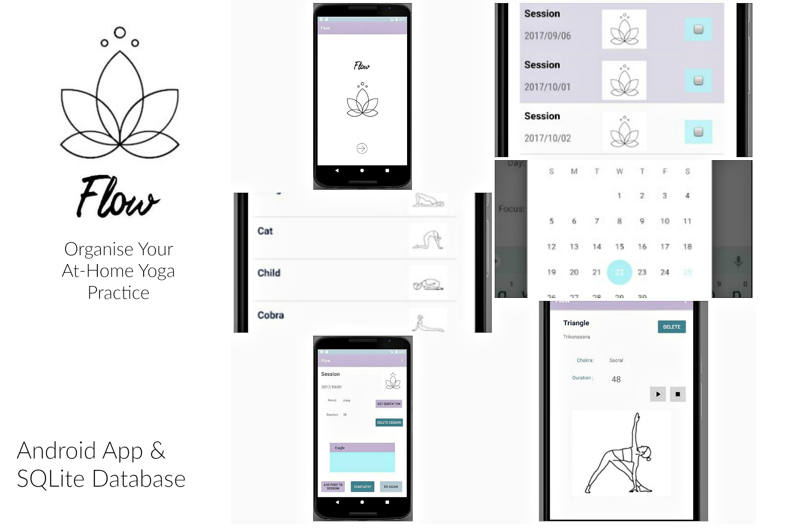

# FlowYogaApp
## Java/Android Studio Project: An App to Organise an At-Home Yoga Practice

Using SQLite Database (3 tables, including 1 join table)

## User can:

* add/delete poses to the app

* create a new session, selecting a date from a pop-up Calendar

* see a list of sessions, ordered by date

* add poses to the session, using a spinner populated with all poses

* stop/start a CountDownTimer for each pose, set to the duration that the user enters when they create the pose

* mark a session as completed (either on ListView or while on the SessionActivity) which greys out the session in the list

* undo marking a session as completed

* access a randomly generated 'quotation of the day' and cycle through these by clicking on a button

## Extension ideas:

* explore ViewPager as a way of showing poses in a session as a 'slideshow'

* add ability to edit sessions/poses

* set up notifications for upcoming sessions
